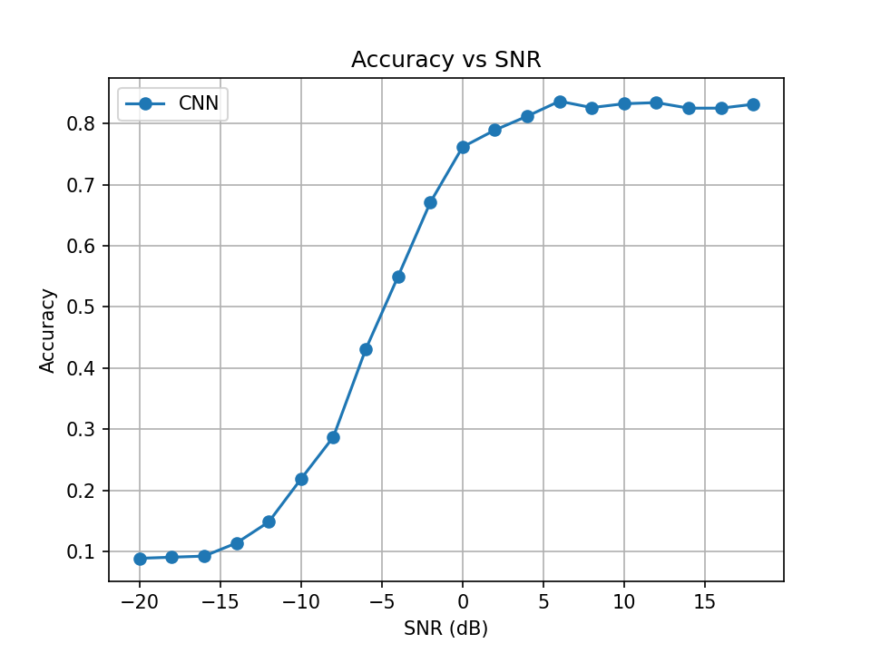
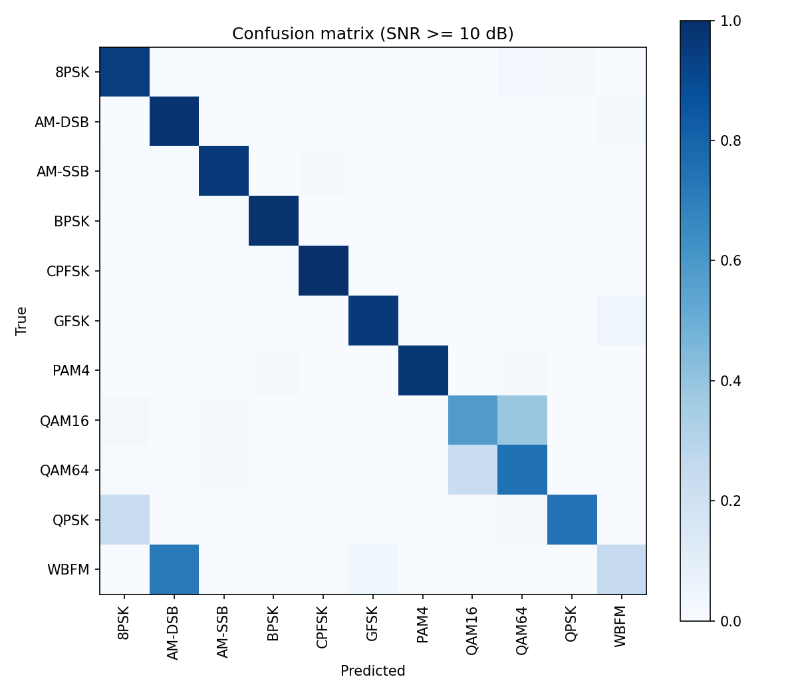

# Automatic Modulation Classification with a 1D-CNN (PyTorch)

A convolutional neural network that identifies the modulation type of a radio signal directly from raw IQ samples, trained and evaluated on the RadioML 2016.10A dataset.

## Problem
Given a short snapshot of a received signal (128 complex samples, stored as I and Q channels), classify which of 11 modulation schemes was used: 8PSK, AM-DSB, AM-SSB, BPSK, CPFSK, GFSK, PAM4, QAM16, QAM64, QPSK, WBFM. This task is known as automatic modulation classification (AMC) and is used in cognitive radio and spectrum monitoring.

## Dataset
- [RadioML 2016.10A](https://www.deepsig.ai/datasets) by DeepSig (CC BY-NC-SA 4.0)
- 220,000 signals: 11 modulations x 20 SNR levels (-20 dB to +18 dB) x 1,000 signals each
- Each sample is a 2 x 128 array (I and Q)
- The dataset is not included in this repository. Download `RML2016.10a_dict.pkl` and place it in `data/`.

## Method
- Split: 60% train / 20% validation / 20% test, stratified by modulation and SNR (fixed seed)
- Model: 1D-CNN with three Conv1d + BatchNorm + ReLU blocks, global average pooling, and a dropout + linear classifier (`src/model.py`)
- Training: Adam (lr 1e-3), cross-entropy loss, batch size 256, 40 epochs, best model chosen by validation accuracy
- The model receives only the raw IQ samples. SNR labels are used only to group the evaluation results.

## Results
| Metric | Value |
|---|---|
| Overall test accuracy (all SNRs) | 54.3% |
| Test accuracy at SNR >= 6 dB | about 83% |
| Test accuracy at -20 dB | about 9% (chance level for 11 classes) |

### Accuracy vs. SNR


Accuracy is at chance level below about -16 dB, rises steeply between -10 dB and 0 dB, and plateaus at about 83% from +6 dB upward.

### Confusion matrix (SNR >= 10 dB)


Most classes are classified almost perfectly at high SNR. The remaining errors are:
- **WBFM is mostly predicted as AM-DSB.** Analog sources have silent stretches where the two signals look alike in a 128-sample window.
- **QAM16 and QAM64 are confused with each other.** Both have grid-shaped constellations that are hard to tell apart with so few samples.
- **QPSK is sometimes predicted as 8PSK.**

## Run it yourself
```bash
pip install -r requirements.txt
python -m src.train --data data/RML2016.10a_dict.pkl
python -m src.evaluate --data data/RML2016.10a_dict.pkl
```
Training saves the best weights to `results/best.pt`. Evaluation writes the plots to `results/`.

## Project structure
```
src/
  data.py       load RadioML and make the stratified split
  model.py      CNN definition
  train.py      training loop
  evaluate.py   test accuracy, accuracy-vs-SNR plot, confusion matrix
results/        plots
```

## Possible improvements
- Learning-rate schedule to smooth validation accuracy
- Deeper model (ResNet or an LSTM layer) for the QAM and WBFM/AM-DSB confusions
- Classical baseline (higher-order cumulants + SVM) for comparison
- Generate your own signals with GNU Radio

## Credit
Dataset: T. J. O'Shea and N. West, "Radio Machine Learning Dataset Generation with GNU Radio" (DeepSig RadioML 2016.10A).
